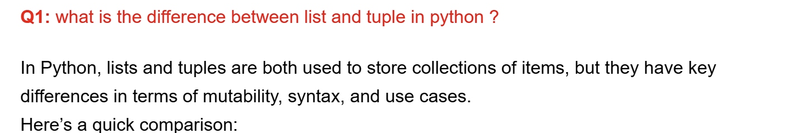
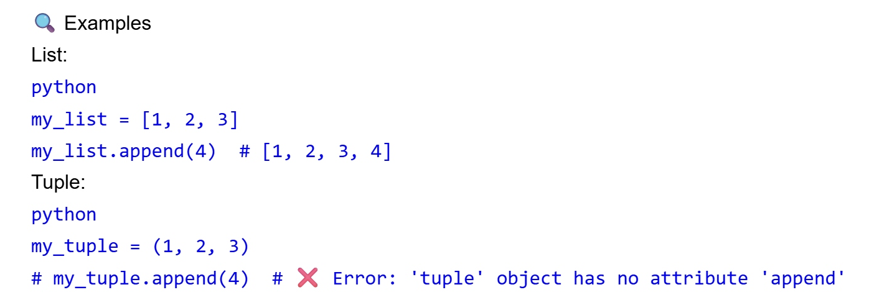
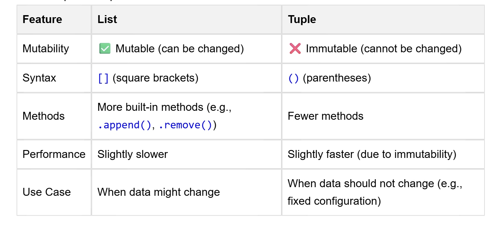

# 🧾 gptPDF – ChatGPT to Styled PDF Exporter

**gptPDF** is a Chrome Extension that lets you export your ChatGPT conversations into clean, professional-looking PDFs. Customize the font size, and preserve code blocks and tables with styling — all in one click!

---

## 🚀 Features

- 📄 Export ChatGPT Q&A as readable PDFs
- 🔤 Adjustable font size (choose from popup)
- 🎨 Colored code blocks (red for prompts, blue for codes, rest is black)
- 🧼 Removes ChatGPT buttons (copy/edit/etc.)
- 📊 Table styling with borders
- 💯 100% client-side – no data leaves your browser

---

## 🧩 Installation

1. **Download or Clone the Repo**

   ```bash
   git clone https://github.com/AlamSirji/gptPDF.git
   ```

   2. **Load the Extension in Chrome**

   - Open Chrome and go to `chrome://extensions/`
   - Enable "Developer mode" (top right)
   - Click "Load unpacked" and select the `gptPDF` folder

   3. **Pin the Extension**

   - Click the puzzle icon in the top right
   - Find **gptPDF** and click the pin icon to keep it visible

   4. **Start Exporting**

   - Open ChatGPT, start a conversation
   - Click the **gptPDF** icon in the toolbar
   - Choose your font size and click "Export to PDF"

   ***

   ## 📸 Screenshots

    <p float="left">
    
    
    
    
    </p>
